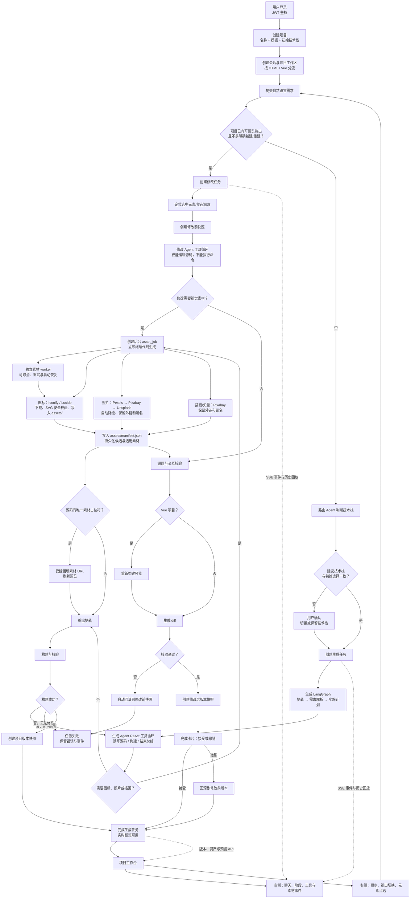

# 项目生命周期流程图

## M3 quality loop

After a successful generation or modification, the platform commits the delivery, then runs an auditable four-dimension evaluation: executability, project structure, user intent and experience, and safety. The intent dimension uses a separate Qwen vision provider with a preview screenshot; source safety findings retain file and line evidence. The project workbench exposes the latest 20-point score, re-check action, and repair recommendations. For a low score, a recommendation becomes a controlled modification task only after the user confirms it; when that task finishes, the workbench automatically shows the fresh evaluation and the score change from the version the user approved.

## M4-1 deployment loop

The user opens the publishing center from the project workbench and publishes the latest successful version snapshot. The server copies a Vue/Vite snapshot's `dist/` delivery, or an HTML/multifile snapshot's static root delivery, into an isolated `storage/publish/{deployment-slug}/` directory, then exposes it at an absolute public URL. Every attempt is recorded with its version number, status, URL, and a readable failure reason; the editable workspace never becomes public.

## M4-2 online version management

Each project has a stable `/sites/{project-slug}/` address which resolves only to its active deployment. Publishing a new delivery makes it active; a successful historical deployment can be selected to restore that version without rebuilding. Taking the active deployment offline removes both its immutable published URL and the stable project address from public access, while retaining its record for a later restore.

## M5-1 operations overview

Administrators can open a dedicated operations dashboard from the project home. It aggregates counts for projects, users, active tasks, and online sites, then separates the underlying records into project, user, task, and deployment views. Both the route and the aggregation API require an administrator role; ordinary users remain in their own project workspace.

## M5-2 operational controls and audit trail

The operations dashboard keeps long lists readable with per-view search and pagination. Administrators can set a user's generation quota, enable or disable other accounts, and requeue a failed asset-collection job through the existing asynchronous task manager. Each successful administrator operation is written to an append-only audit record. Deployment creation, activation, and offlining are recorded in the same trail, so the platform can explain who changed an online delivery and when.

## M6-0 observability

The administration console is organised into four primary workspaces: a platform dashboard, project management, user management, and operation management. The dashboard reports API/database/queue/provider health, queue depth, success rate, actionable alerts, and only the newest twelve events. Project management separates projects, asset and task records, deployment versions, and a per-project observability view. The latter limits the selected project's execution chain to its newest twenty events, preventing an unbounded global timeline while retaining diagnosable evidence.

## 关键规则

- 生成任务和修改任务都可使用受控素材收集；图片来源失败时会降级，不阻断项目交付。
- 修改仅允许改源码；构建、源码或交互校验失败会自动恢复修改前快照。
- 每次成功生成或修改都会创建版本快照；项目可查看版本、差异并回滚。
- SSE 支持事件递增 ID 与 `Last-Event-ID` 补发；重新进入运行中的项目可恢复任务订阅与会话历史。
